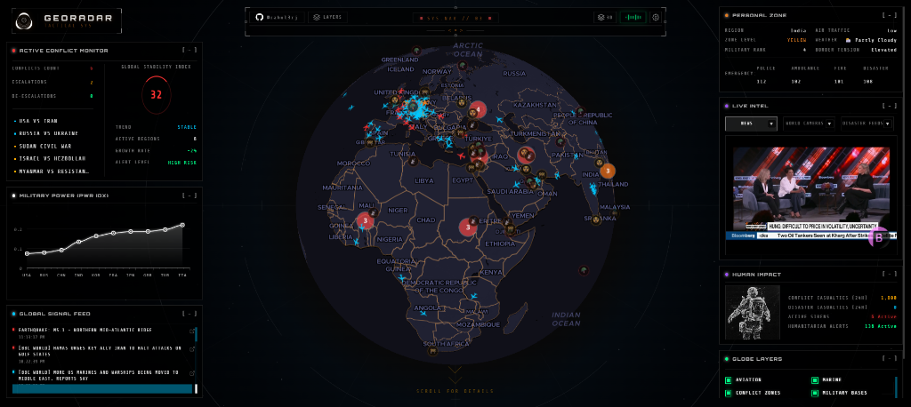

<div align="center">

# 🌐 GeoRadar — Tactical Intelligence Command Center

**Real-time global intelligence monitoring • OSINT aggregation • Conflict tracking • Aviation & marine surveillance**

[](https://github.com/rahul3rj/GeoRadar)
[](./LICENSE)
[](https://nodejs.org)
[](https://react.dev)
[](https://expressjs.com)
[](https://www.mongodb.com)

</div>

---



---

## 🎯 What is GeoRadar?

GeoRadar is a **real-time global intelligence command center** that monitors, aggregates, and visualizes worldwide data — from live aviation traffic and maritime vessel tracking to open-source intelligence (OSINT) events like earthquakes, severe weather, wildfires, armed conflicts, and breaking news.

Built with a **military/tactical HUD aesthetic**, GeoRadar provides a comprehensive operational picture of the world on a single screen — the kind of dashboard you'd expect to see in a situation room.

> ⚠️ **Desktop Only** — GeoRadar is designed for full-screen desktop use (1920×1080 recommended). Mobile devices are intentionally blocked.

---

## ✨ Key Features

### 🌍 3D Globe Visualization
- **MapLibre GL JS** powered globe with 3 switchable tile styles (Dark, Satellite, Night)
- Interactive country borders with click-to-highlight
- Conflict zone country highlighting with severity-based coloring
- Auto-rotation, 3D tilt, and fly-to-location animations
- Custom HUD canvas background with cyberpunk aesthetics

### ✈️ Live Aviation Tracking
- Real-time aircraft positions via **ADS-B** providers (adsb.lol, OpenSky, ADSBx)
- Waterfall failover strategy with automatic provider cooldowns
- Color-coded aircraft by category (passenger, cargo, military, emergency)
- Click-to-inspect flight details with animated popups
- Client-side position interpolation for smooth movement

### 🚢 Marine Vessel Tracking
- Real-time ship positions via **AISStream** WebSocket
- Canvas-drawn ship icons with heading rotation
- Vessel classification (cargo, tanker, military)
- Maritime chokepoint congestion alerts (Suez, Hormuz, Malacca, Panama, Bab el-Mandeb)

### ⚔️ Conflict Intelligence
- **ACLED** weekly conflict data ingestion with automatic scheduling
- Clustered conflict markers with severity coloring (green→yellow→orange→red)
- **5-component Global Stability Index** with weighted composite scoring
- Escalation/de-escalation trend tracking
- Actor normalization and historical comparison
- Click-to-fly interaction from conflict list to globe location

### 📡 OSINT Signal Feed
- 12+ data providers aggregating global intelligence signals
- Real-time WebSocket broadcast with anomaly detection
- Event merging and correlation (earthquake+news, multi-source protests)
- Explosion detection from seismic patterns
- Severe earthquake alerts with globe focus

### 📰 Multi-Source News Aggregation
- 5 category news feeds (Global, Tech, Market, Space, Climate)
- RSS aggregation from BBC, NYT, Al Jazeera, TechCrunch, CNBC, NASA, and more
- Local news by user's geolocation via Google News
- OSINT social media feed from 6 tracked X/Twitter accounts

### 🗺️ Infrastructure Overlays
- 8 static data layers: Nuclear sites, Military bases, NOTAMs, Maritime chokepoints, Oil pipelines, Submarine cables, Data centers, Launch sites
- Interactive popups with detailed facility information

### 🛡️ Personal Zone Assessment
- Browser geolocation with zone risk classification (Green/Yellow/Red)
- Country-specific data (disputed borders, military rank, emergency numbers)
- Local weather integration
- Nearby air traffic density

---

## 🏗️ Architecture

```
┌─────────────────────────────────────────────────────────────┐
│                       GeoRadar                              │
├──────────────────────────┬──────────────────────────────────┤
│      GeoRadarBE          │          GeoRadarFE              │
│  Node.js / Express 5     │     React 19 / Vite 7            │
│  MongoDB / WebSocket     │     MapLibre GL / Tailwind       │
├──────────────────────────┼──────────────────────────────────┤
│                          │                                  │
│  12+ OSINT Providers ────┼──► REST API ──► Dashboard Panels │
│  Aviation Waterfall  ────┼──► REST API ──► AviationLayer    │
│  Marine AISStream    ────┼──► REST API ──► MarineLayer      │
│  Conflict Pipeline   ────┼──► REST API ──► ConflictLayer    │
│  Analysis Engines    ────┼──► REST API ──► ConflictPanel    │
│  News Aggregation    ────┼──► REST API ──► DetailsPanel     │
│  OSINT Scraping      ────┼──► REST API ──► OSINT Feed       │
│  Signal Broadcast    ────┼──► WebSocket ─► SignalFeedPanel  │
│                          │                                  │
└──────────────────────────┴──────────────────────────────────┘
```

**The frontend NEVER contacts external APIs directly** (except MapTiler tiles, YouTube iframes, Open-Meteo weather, and Nominatim geocoding). All intelligence data flows through the backend.

---

## 🚀 Quick Start

### Prerequisites

- **Node.js** ≥ 18
- **npm** ≥ 9
- **MongoDB** ≥ 6 (optional — system works without it using file-based fallback)

### Installation

```bash
# Clone the repository
git clone https://github.com/rahul3rj/GeoRadar.git
cd GeoRadar
```

### Backend Setup

```bash
cd GeoRadarBE
npm install

# Create environment file
cp .env.example .env
# Edit .env with your API keys (all optional — system has fallbacks)

npm run dev          # Starts on port 4000 with --watch
```

### Frontend Setup

```bash
cd GeoRadarFE
npm install
npm run dev          # Starts Vite dev server on port 5173
```

### Environment Variables

Create `GeoRadarBE/.env`:

```env
PORT=4000
MONGODB_URI=mongodb://localhost:27017
MONGODB_DB=georadar

# Optional — system works without these (uses fallback/simulation)
OPENSKY_CLIENT_ID=your-opensky-client-id
OPENSKY_CLIENT_SECRET=your-opensky-secret
ADSBEXCHANGE_API_KEY=your-adsbx-key
ACLED_EMAIL=your-acled-email
ACLED_PASSWORD=your-acled-password
AISSTREAM_API_KEY=your-aisstream-key
```

> **Note:** All API keys are optional. The system gracefully falls back to simulated data, mock datasets, or alternative providers when keys are not configured.

---

## 🧠 Intelligence Pipeline

### Data Providers

| Provider | Source | Type | Interval |
|----------|--------|------|----------|
| **ADSBLolProvider** | adsb.lol | Aviation | On-demand |
| **OpenSkyProvider** | OpenSky Network | Aviation | On-demand |
| **SimulatedProvider** | OpenFlights data | Aviation (fallback) | On-demand |
| **AISStreamProvider** | AISStream WebSocket | Marine | Real-time |
| **EarthquakeProvider** | USGS GeoJSON | OSINT | 60s |
| **WeatherProvider** | Open-Meteo | OSINT | 5 min |
| **WildfireProvider** | NASA FIRMS | OSINT | 10 min |
| **RSSNewsProvider** | BBC/NYT/Al Jazeera | OSINT | 5 min |
| **DisasterAlertProvider** | NOAA/FEMA | OSINT | 5 min |
| **ACLEDProvider** | ACLED Conflict Data | Conflict | 12 hrs |
| **CategoryNewsProvider** | Multi-source RSS | News | 5 min |
| **NitterOSINTProvider** | X/Twitter (Nitter) | Social Media | 5 min |

### Analysis Engines

| Engine | Purpose |
|--------|---------|
| **ConflictEngine** | 5-component weighted Global Stability Index, actor normalization, escalation tracking |
| **ZoneEngine** | Personal zone risk assessment (Haversine distance, 500km radius) |
| **StabilityEngine** | Global stability score (0-100) with conflict/disaster penalties |
| **AnomalyDetector** | Pattern detection (emergency clusters, seismic unrest, civil unrest spikes) |

### Global Stability Index (GSI)

The GSI uses a **5-component weighted composite formula**:

| Component | Max Points | Method |
|-----------|-----------|--------|
| Conflict Severity | 40 | Diminishing returns curve |
| Active Sirens | 15 | NOAA + weather + emergency flights |
| Fatality Weight | 20 | Logarithmic scale |
| Geographic Spread | 10 | Unique conflict countries |
| Escalation Momentum | 15 | Escalating regions × 3 |

---

## 📡 API Reference

| Method | Endpoint | Description |
|--------|----------|-------------|
| `GET` | `/api/flights` | Cached flight data + stats |
| `GET` | `/api/marine` | Vessel positions (zoom-adaptive) |
| `GET` | `/api/marine/alerts` | Chokepoint congestion alerts |
| `GET` | `/api/conflict-status` | Conflict analysis + GSI |
| `GET` | `/api/conflicts` | Conflict events for map markers |
| `GET` | `/api/conflict-summary` | Per-country intensity scores |
| `GET` | `/api/human-impact` | Casualty/siren/alert metrics |
| `GET` | `/api/zone-status` | Personal zone risk |
| `GET` | `/api/global-stability` | Global stability score |
| `GET` | `/api/news/:category` | Category news feed |
| `GET` | `/api/news/local` | Local news by country |
| `GET` | `/api/osint-feed` | OSINT social media posts |
| `GET` | `/api/health` | System health check |
| `POST` | `/api/conflicts/ingest` | Manual ACLED CSV ingestion |
| `WS` | `ws://localhost:4000` | Real-time signal broadcast |

---

## 🎨 Design System

GeoRadar uses a **military tactical HUD** design language:

- **Fonts:** `Orbitron` (headings) • `Share Tech Mono` (body/data)
- **Colors:** Cyan `#00c8ff` (info) • Red `#ff3232` (critical) • Orange `#e67e22` (warning) • Green `#00ff88` (safe) • Purple `#a050ff` (special)
- **Panels:** Dark glass (`rgba(0,0,0,0.72)`) with corner bracket decorators, blur backdrop
- **Animations:** Pulsing status dots, smooth lerp transitions, animated HUD canvas background

---

## 🛠️ Tech Stack

| Layer | Technologies |
|-------|-------------|
| **Backend** | Node.js (ES Modules) • Express 5 • WebSocket (`ws`) • MongoDB |
| **Frontend** | React 19 • Vite 7 • Tailwind CSS 4 • MapLibre GL JS |
| **Database** | MongoDB (optional — graceful fallback) |
| **Map** | MapTiler tiles (Dark/Satellite/Night) via MapLibre GL |
| **Audio** | HUD sound effects (click/hover — toggleable) |

---

## 📁 Project Structure

```
GeoRadar/
├── GeoRadarBE/                     # Backend
│   ├── server.js                   # Express + WebSocket + pipeline
│   ├── providers/                  # 4 aviation + 8 OSINT data providers
│   │   └── osint/                  # Extended OSINT (ACLED, RSS, Nitter, etc.)
│   ├── analysis/                   # Intelligence engines (Conflict, Zone, Stability, Anomaly)
│   ├── services/                   # ACLED ingestion + scheduling
│   ├── db/                         # MongoDB connection
│   └── datasets/                   # Static JSON datasets
│
├── GeoRadarFE/                     # Frontend
│   └── src/
│       ├── components/
│       │   ├── Globe.jsx           # MapLibre 3D globe with HUD canvas
│       │   ├── AviationLayer.jsx   # Aircraft tracking layer
│       │   ├── MarineLayer.jsx     # Ship tracking layer
│       │   ├── ConflictLayer.jsx   # Conflict markers + country highlighting
│       │   ├── InfrastructureLayers.jsx  # 8 static overlay layers
│       │   ├── MobileBlocker.jsx   # Mobile device access restriction
│       │   ├── Navbar.jsx          # HUD navigation + settings
│       │   └── panels/             # 9 dashboard panels
│       └── pages/                  # 6 route pages
│
├── GeoRadar_Documentation.md       # Full technical documentation
├── LICENSE                         # GNCOSL v1.0
└── README.md                       # This file
```

---

## 🌐 Deployment

GeoRadar is designed for deployment on:

| Service | Purpose |
|---------|---------|
| **Vercel** | Frontend (static React build) |
| **Render** | Backend (Node.js + WebSocket) |
| **MongoDB Atlas** | Database (free M0 tier) |

The project includes `vercel.json` with API proxy rewrites and SPA routing. All frontend API calls use environment-aware URLs that work both locally and in production.

See `GeoRadar_Documentation.md` for the full deployment guide.

---

## 📜 License

GeoRadar is released under the **GeoRadar Non-Commercial Open Source License (GNCOSL) v1.0**.

| Use Case | Allowed? |
|----------|----------|
| ✅ Personal / research / educational | **Yes** |
| ✅ Self-hosted (non-commercial) | **Yes**, with attribution |
| ✅ Fork and modify (non-commercial) | **Yes**, share source changes |
| ❌ Commercial use / SaaS / rebranding | **Requires commercial license** |

**TL;DR:** You can use, study, modify, and self-host GeoRadar for free as long as it's non-commercial. Want to use it commercially? Get in touch.

See [LICENSE](./LICENSE) for the full license text.

---

## 🤝 Contributing

Contributions are welcome for non-commercial improvements. Please:

1. Fork the repository
2. Create a feature branch (`git checkout -b feature/amazing-feature`)
3. Commit your changes (`git commit -m 'Add amazing feature'`)
4. Push to the branch (`git push origin feature/amazing-feature`)
5. Open a Pull Request

All contributions are subject to the [GNCOSL v1.0](./LICENSE) license.

---

## 🙏 Acknowledgments

- **ACLED** — Armed Conflict Location & Event Data
- **USGS** — Earthquake data
- **NASA FIRMS** — Wildfire detection
- **NOAA/FEMA** — Disaster alerts
- **OpenSky Network** — Aviation data
- **AISStream** — Marine vessel data
- **MapTiler** — Map tile services
- **OpenFlights** — Airport and route data

---

<div align="center">

**Built with 🧠 by [rahul3rj](https://github.com/rahul3rj)**

*GeoRadar is an independent project and is not affiliated with any government or military organization.*

</div>
